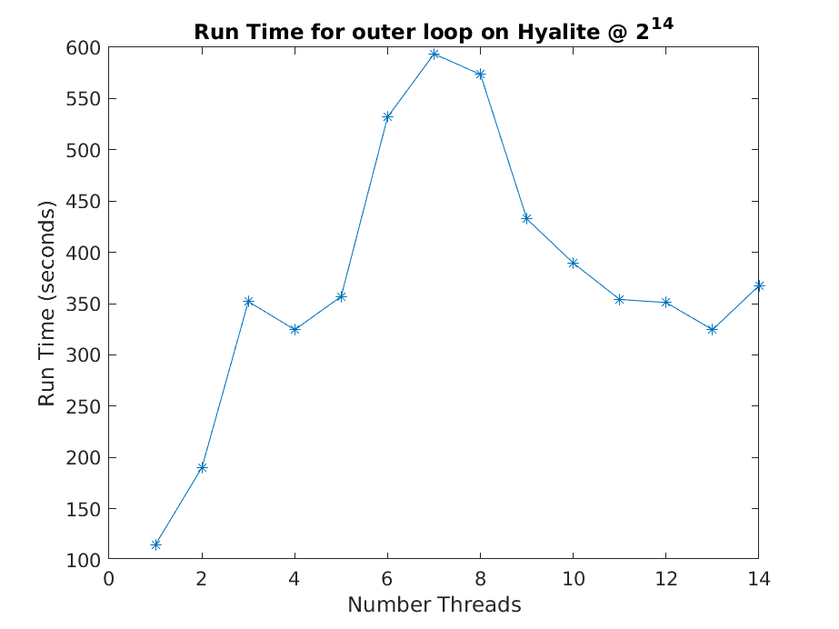

## Introduction
The computation that was chosen was that of a simulation.
This simulation is a Pulse Aptitude Modulation (PAM) with a AWGN channel.
This was chosen as it was a simple but also embarrassingly parallel.
The simulation is embarrassingly parallel because the is no interdependencies between simulations.
Each simulation is independent, this allows for any number of different simulations to be ran at once.    
 
## Overview of pthreads in simulation
{width=50%}

{width=50%}

The pthread specific functions that are used are *pthread_create()*, *pthread_barrier_init()* and *pthread_barrier_wait()*.
* *pthread_create()* is called with _pthread_create(&threads[i], NULL, Sim, (void *)&data[i])_.
  * Gives the function the thread to execute instructions on, the function to call and the data to pass it
  * Here the data is a que of signals to simulate
  * Here each thread will process each que it is given
* The *pthread_barrier_init()* is called with _pthread_barrier_init(&barrier, NULL, num_threads + 1)_.
  * This initializes the barrier with the number of times to call the barrier before the simulation is allowed to continue.
  * Initialized to be the number of threads + 1 to allow the all the threads to finish and for the program to wait until this happens
* The *pthread_barrier_wait()* is called with _pthread_barrier_wait(&barrier)_.
  * Calls the barrier and has the thread wait until the barrier has been called enough times
  * This makes sure all the simulations finish before the results print

In order to vary the number threads each thread gets a que of simulations (signal structure) to execute.
Each que has approximately the same number of simulations as each simulation is assigned based on the modulus of the index and the number of threads.
This type of queuing allows to only spawn the number threads specified versus in previous implementations spawning the number of different simulations but only allowing the number of threads to execute at once.

## Pthreads Results
The simulations on Hyalite was ran 40 or 50 times to help rid of outliers.
The simulations on the laptop Ryzen 5-4600U (6c/12t) and desktop Intel i9-10900F (10c/20t) where ran 6 times for the same reason.
The raw data is on the class github.

{width=50%}

{width=50%}

{width=50%}
 

{width=50%}

## Overview of mpi in simulation
{width=50%}  

The mpi specific functions that are used are *MPI_Send()*,*MPI_Recv()* and MPI_Finalize().
* MPI_Send(&sim_err, 1, MPI_UINT64_T, MASTER, mtype, MPI_COMM_WORLD)
  * &sim_err is pointer to the number of error of a given simulation
  * MPI_UINT64_T is the unsigned integer of size 64 bit for mpi
  * mtype or message type
* MPI_Recv(&rc_err, 1, MPI_UINT64_T, MPI_ANY_SOURCE, mtype, MPI_COMM_WORLD, &status)
  * &rc_err is pointer to the number of error of a given simulation as received
  * MPI_UINT64_T is the unsigned integer of size 64 bit for mpi
  * MPI_ANY_SOURCE allows to receive from anywhere
  * mtype or message type
  * &status is the status of the receive
* MPI_Finalize();
  * tells mpi the mpi part is done

## MPI Results
{width=50%}

## Discussion
Since it was chosen to implement pthreads first, a que was used, perhaps mpi would have been even faster if the data was being handled more efficiently.
It was noticed that the pthreads implementation was slower than just doing it serial.
This could be explained by the pthreads scheduling had to much overhead for the amount of compute it was doing.
Perhaps if there was more time, a good look into making a loop longer and have more compute would make the pthreads scale well.
The simulation was chosen to be easily parallelized but it in the end it would have taken more time to get the program to scale.
Since the serial program is faster and the problem is embarrassingly parallel perhaps just using cli arguments and the serial program would be the best solution.
This has made me appreciate the parfor in matlab but also when a program can be ran independent of itself one should. 

by Alex Salois