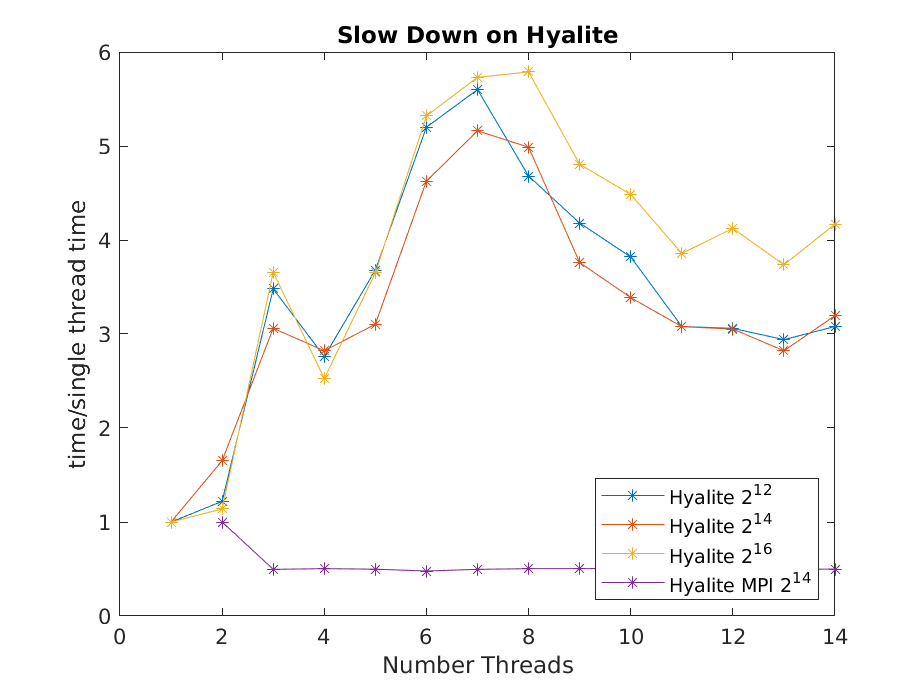

## Introduction
The computation that was chosen was that of a simulation.
This simulation is a Pulse Aptitude Modulation (PAM) with a AWGN channel.
This was chosen as it was a simple but also embarrassingly parallel.
The simulation is embarrassingly parallel because the is no interdependencies between simulations.
Each simulation is independent, this allows for any number of different simulations to be ran at once.    
 
## Overview of pthreads in simulation
  
As seen in the above figure the simulation is broken down into a per snr basis. 

  
In the above figure one can see that each thread gets a que of signals to process.

The pthread specific functions that are used are *pthread_create()*, *pthread_barrier_init()* and *pthread_barrier_wait()*.
* *pthread_create()* is called with _pthread_create(&threads[i], NULL, Sim, (void *)&data[i])_.
  * Gives the function the thread to execute instructions on, the function to call and the data to pass it
  * Here the data is a que of signals to simulate
  * Here each thread will process each que it is given
* The *pthread_barrier_init()* is called with _pthread_barrier_init(&barrier, NULL, num_threads + 1)_.
  * This initializes the barrier with the number of times to call the barrier before the simulation is allowed to continue.
  * Initialized to be the number of threads + 1 to allow the all the threads to finish and for the program to wait until this happens
* The *pthread_barrier_wait()* is called with _pthread_barrier_wait(&barrier)_.
  * Calls the barrier and has the thread wait until the barrier has been called enough times
  * This makes sure all the simulations finish before the results print

In order to vary the number threads each thread gets a que of simulations (signal structure) to execute.
Each que has approximately the same number of simulations as each simulation is assigned based on the modulus of the index and the number of threads.
This type of queuing allows to only spawn the number threads specified versus in previous implementations spawning the number of different simulations but only allowing the number of threads to execute at once.

## Overview of mpi in simulation
## Results
The simulations on Hyalite was ran 40 or 50 times to help rid of outliers.
The simulations on the laptop Ryzen 5-4600U (6c/12t) and desktop Intel i9-10900F (10c/20t) where ran 6 times for the same reason.
The raw data is on the class github.

There was only one consistent non negative scaling.
I believe this was due to clock speed scaling on my laptop.
It would not boost unless it had at least 2 threads running.

As seen above Hyalite scales better than the others on 8 threads and above but falls short on 2 and 3 threads.
This again could be due to a number of factors, however clock speed fell as the number of threads increased for the laptop and desktop.  

Here as the number of iterations goes to 2 to 16 the scaling gets worse not better.
This is the opposite of what was expected, it was thought that if each thread had more work to do it would scale better.  

## Discussion
